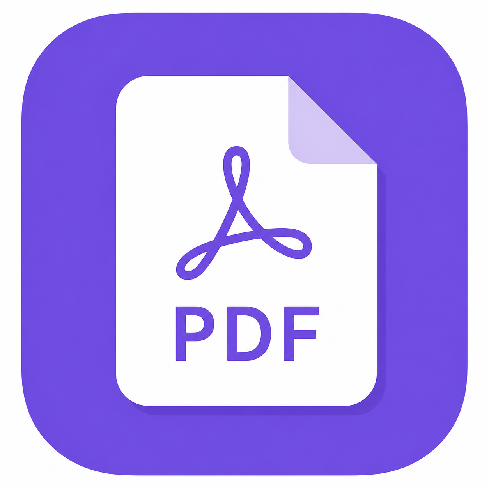
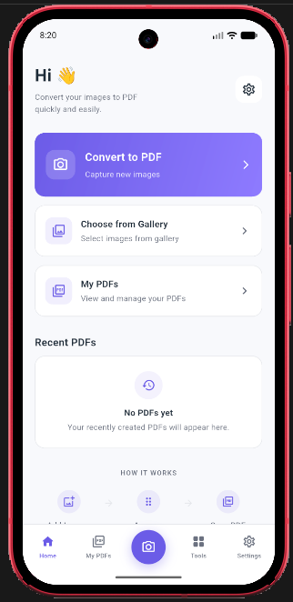
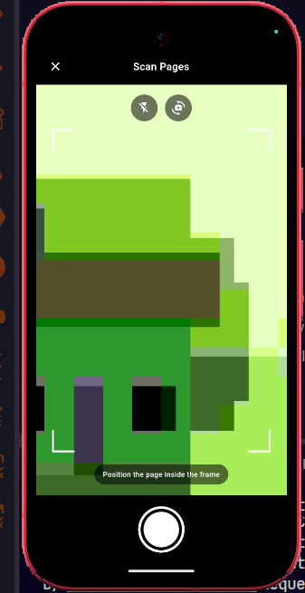
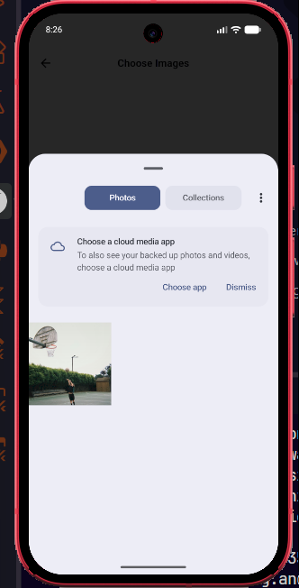
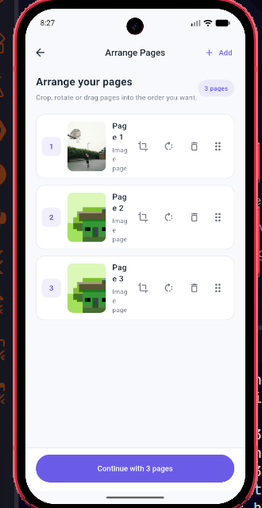
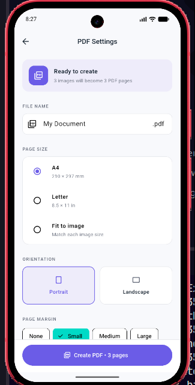
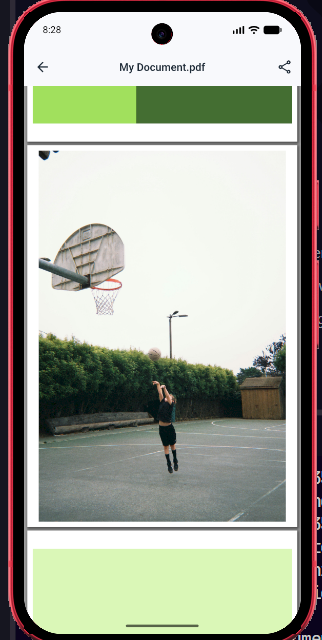
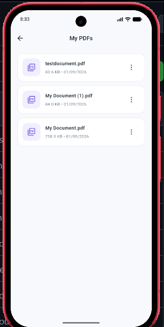
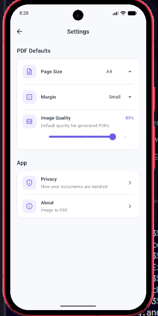

# 📄 Image to PDF

<p align="center">
  
</p>

<h3 align="center">Turn images and scanned documents into PDFs — directly on your device.</h3>

<p align="center">
  A simple, fast, and privacy-focused Android application built with Flutter for scanning documents, converting images to PDF, arranging pages, customizing output, and managing generated PDFs.
</p>

<p align="center">
  
  
  
  
</p>

---

## ✨ Overview

**Image to PDF** is an Android document utility that lets you create polished PDF documents from your camera or existing images.

The entire workflow — importing, editing, arranging, configuring, generating, and managing PDFs — is handled directly on the device.

No account required.  
No backend required.  
No document upload required.

---

## 📱 Screenshots

<p align="center">
  
  &nbsp;&nbsp;
  
  &nbsp;&nbsp;
  
</p>

<p align="center">
  
  &nbsp;&nbsp;
  
  &nbsp;&nbsp;
  
</p>

<p align="center">
  
  &nbsp;&nbsp;
  
</p>

> Screenshots can be added to `assets/screenshots/` using the filenames shown above.

---

## 🚀 Features

### 📷 Document Scanner

Capture documents directly using the device camera.

- Multi-page capture
- Document detection
- Perspective correction
- Image enhancement
- Camera switching
- Flash control
- Tap-to-focus
- Continuous scanning workflow

### 🖼️ Images to PDF

Select multiple images from your gallery and combine them into a single PDF document.

- Multi-image selection
- Add more images later
- Remove unwanted pages
- Visual page numbering

### ✂️ Image Editing

Prepare pages before generating the final PDF.

- Crop images
- Rotate pages
- Reorder pages
- Add additional pages from camera or gallery

### 📄 PDF Configuration

Customize the generated document before exporting it.

**Page sizes**

- A4
- Letter
- Fit to Image

**Orientation**

- Portrait
- Landscape
- Automatic orientation when using Fit to Image

**Margins**

- None
- Small
- Medium
- Large

**Image Quality**

Adjust image compression to balance PDF quality and file size.

### 👁️ PDF Preview

Preview generated PDF documents directly inside the application before sharing or exporting them.

### 📚 PDF Management

Generated PDFs are stored in the application's local document library.

You can:

- Preview
- Rename
- Share
- Export
- Delete

### ⚙️ Persistent Preferences

Your preferred PDF settings are remembered between app launches.

Saved preferences include:

- Default page size
- Default margin
- Default image quality

---

## 🔒 Privacy First

Image to PDF is designed around local processing.

Your images and generated PDF documents are processed directly on your device rather than being uploaded to an external document-processing server.

This means:

- No account is required
- No cloud processing is required
- No backend server is required for PDF generation
- Your documents remain under your control

---

## 🧭 Application Flow

```text
Camera / Gallery
       │
       ▼
 Image Selection
       │
       ▼
 Crop / Rotate
       │
       ▼
 Arrange Pages
       │
       ▼
  PDF Settings
       │
       ▼
 Generate PDF
       │
       ▼
 PDF Preview
       │
       ▼
Save / Share / Export
```

---

## 🛠️ Tech Stack

| Technology         | Purpose                            |
| ------------------ | ---------------------------------- |
| Flutter            | Application framework              |
| Dart               | Programming language               |
| camera             | Custom camera experience           |
| document_scan      | Document detection and enhancement |
| image_picker       | Gallery and image selection        |
| image_cropper      | Image cropping                     |
| image              | Image manipulation and compression |
| pdf                | PDF generation                     |
| pdfrx              | PDF rendering and preview          |
| path_provider      | Local application storage          |
| share_plus         | Native sharing                     |
| file_picker        | PDF export                         |
| shared_preferences | Persistent application settings    |

---

## 🏗️ Architecture

The application follows a simple service-oriented Flutter structure.

```text
lib/
│
├── core/
│   └── theme/
│
├── screens/
│   ├── home/
│   ├── camera/
│   ├── gallery/
│   ├── create_pdf/
│   ├── tools/
│   └── settings/
│
├── services/
│   ├── image_picker_service.dart
│   ├── pdf_service.dart
│   ├── settings_service.dart
│   └── ...
│
├── app.dart
└── main.dart
```

UI, device functionality, PDF processing, and persistence are separated into screens and services to keep the codebase maintainable.

---

## 🧠 PDF Generation

PDF generation happens entirely on-device.

Before an image is embedded into a PDF, the application can:

1. Decode the source image
2. Resize excessively large images
3. Apply the selected JPEG quality
4. Determine the requested PDF page format
5. Apply margins and orientation
6. Embed the processed image
7. Generate the final PDF
8. Save it to local application storage

For **Fit to Image**, the PDF page dimensions are derived from each image, allowing portrait and landscape images to retain their natural orientation.

---

## 📦 Getting Started

### Prerequisites

Make sure you have:

- Flutter SDK
- Dart SDK
- Android SDK
- Android Studio or VS Code
- An Android emulator or physical Android device

Check your Flutter environment:

```bash
flutter doctor
```

### Clone the Repository

```bash
git clone <YOUR_REPOSITORY_URL>
cd image_to_pdf
```

### Install Dependencies

```bash
flutter pub get
```

### Run the Application

```bash
flutter run
```

---

## 📲 Build Android APK

Create a release APK:

```bash
flutter build apk --release
```

The generated APK can be found at:

```text
build/app/outputs/flutter-apk/app-release.apk
```

---

## 📦 Build Android App Bundle

For Google Play distribution:

```bash
flutter build appbundle --release
```

The generated bundle can be found at:

```text
build/app/outputs/bundle/release/app-release.aab
```

> Release signing credentials and keystore files are intentionally excluded from version control.

---

## 🗺️ Roadmap

Possible future improvements include:

- [ ] OCR and searchable PDFs
- [ ] Merge existing PDFs
- [ ] PDF compression tool
- [ ] Password-protected PDFs
- [ ] Improved real-time document edge detection
- [ ] Additional page sizes
- [ ] PDF metadata editing
- [ ] Improved export options

---

## 🤝 Contributing

Contributions, suggestions, and bug reports are welcome.

If you'd like to contribute:

1. Fork the repository
2. Create a feature branch
3. Make your changes
4. Commit your changes
5. Push the branch
6. Open a pull request

---

## 📄 License

This project does not currently specify an open-source license.

If you plan to make the repository open source, add an appropriate `LICENSE` file before allowing redistribution or modification.

---

## 👨‍💻 Author

**Arion Dutta**

Built with Flutter as a lightweight, privacy-focused way to turn images and scanned documents into PDF files.

---

<p align="center">
  <b>Scan. Arrange. Convert. Done.</b>
</p>

<p align="center">
  Built with 💜 and Flutter.
</p>
